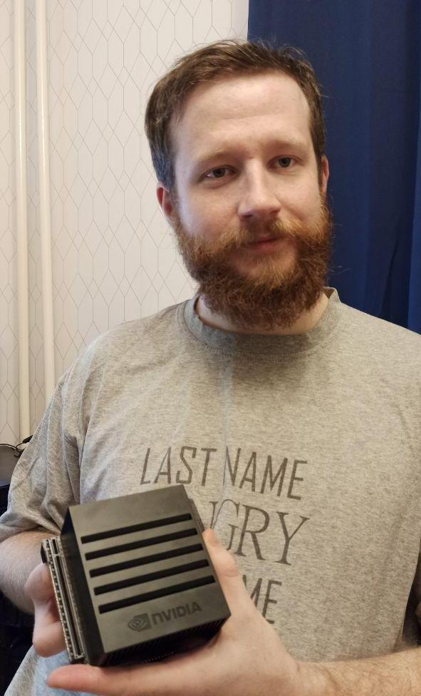

# Вводное слово. Первый релиз, конкурс пакетов и ROS meetup

Идея разработки данного пакета у меня зародилась достаточно давно, однако разработка его шла медленно. Разработку парадигмы распознавания я проводил в рамках исследований в своей кандидатской диссертации, над которой сейчас тружусь. До анонса конкурса открытых пакетов, российским ROS сообществом (положения конкурса можно прочесть [тут](https://docs.google.com/document/d/1psn7LKqXBHg2ssITKNiIX_ILGxbhr-J4djv5jnkPIVw/edit#heading=h.k38lokd47ucp)) пакет представлял собой разрозненные, по большей части не унифицированные и не документированные куски кода. Когда был предложен конкурс, то я подумал, что это шанс и хорошая мотивация для того, чтобы привести решение в порядок, добавив самые используемые разработчиками роботов подходы. Естественно, вероятность выиграть один из джетсонов также не могла не подогревать мой настрой. Распланировав свою работу на полгода, таков был срок конкурса, я приступил. По моим ощущениям в течении этого времени я реализовал больше 70% того, что есть в пакете на момент первого релиза, конечно если учитывать механизмы что были переписаны, изменены и как-то оптимизированы. 

## Парадигма решения простыми словами

Наверное я уже много где говорил о той парадигме, в которой работает мой пакет, но думаю в этом блоге могу еще раз по ней пройтись, не придерживаясь строгого слога. Итак, предположим есть некоторый объект, что надо распознать. Как и любой объект в этом мире он имеет ряд __признаков__, которые в совокупности характеризуют именно его, отличая ото всех других объектов в этом мире. Такими признакми могут выступать опредленный образ объекта, его форма, его цветовые или текстурные характеристики, положение в пространстве, физические размеры, наличие каких-то опозновательных знаков и т.д. Как можно заметить эти признаки делятся на классы, тогда можно завести программный детектор, который распознавал бы тем или иным методом область на изображении, котоаря соотвествует описанию конкретного класса признака. А дальше объединять эти области по положению в пространстве и если все нужные нам признаки срабатывают в одной области, то значит эта и есть область искомого объекта. Таким образом, для распознавания объекта требуется указать его признаки и распознать их отдельно определенными методами компьютерного зрения, которых к счастью на данный момент великое множество.

С другой стороны в реальном мире встречается ряд проблем, которые мешают устоячиво решать задачи распознавания. Среди них можно отметить нестабильное освещение, изменение ракурса наблюдения объекта, частичное перекрытие объекта другими элементами среды и различные шумы. Соотвественно, если из-за подобных ограничений хотя бы один из детекторов признаков объекта не даст в области положительного результата, то объект не будет распознан полностью методикой, указанной выше. Задумавшись об этом, я решил разделить подход к детектированию объекта по частям на два режима: __жесткий и мягкий__. Жесткий режим как раз тот, что требует наличия всех признаков в одной области, чтобы считать объект распозанным. Мягкий же режим, разработан так, что допускает отсутствие некотрых признаков. Однако, чтобы иметь возможность как то оценивать результат такого распознавания вводится __коэффициент уверенности__ распознавания объекта. Этот коэффициент расчитывается путем сложения вкладов всех распознанных признаков, помноженных на их вес. Далее полученная сумма нормируется на единицу путем деления на сумму максимального вклада всех признаков помноженных на их вес. Вклад признака,это число от 0 до 1, которое характеризует, как конкретный метод оценивает результат распознавания. Например в сверточных нейронных сетях в качестве вклада используется вероятность распознавания. Вес же признака, это пользовательская настройка, позволяющая сделать вклад одних признаков более значимым, по отношению к другим. Далее, имея на руках данный коэффициент, можно уже оценить качество распознавания в таком режиме, например считая, что все, что выше 0.75 нас устраивает. 

Определив такой подход и начав его реализовывать, я столкнулся с тем, что ряд объектов имеют весьма сложную структуру и их признаки весьма сложно описать в рамках одного класса. Например они имеют много разных цветов, в своем составе или нетривиальную форму, изменяющуюся в зависмости от ракурса. Тогда я решил надстроить над предложенным подходом еще один, который способен объединить несколько объектов в один большой, указав как объекты в его составе связаны друг с другом. С этого момента объекты, которые состоят только из признаков я стал называть __простые объекты__, а те, что являются совокупностью простых - __сложными объектами__. В рамках сложного объекта были введены __отношения__ которые и позволяют настроить связи между простыми. Решение задачи опредления сложных объектов по такому описанию и является важной частью моей диссертации. 

## Какие требования я поставил к пакету 

Теперь можно от теории перейти к практике. Я хочу добиться того, чтобы пакет был удобен в использовании и покрывал обширную область технического зрения в области распознавания объектов. Для этого я решил, что пакет должен быть оформлен в рамках целостного решения, а не предоставлять API, тем самым давая возможность добавлять распознавание в своих роботов людям, которые не являются специалистами в этой области, сильно экономя на этом время. Также хочется думать, что пакет будет полезен и CV-специалистам, как минимум, давая возможность быстро проверить те или иные методы, перед тем, как писать, что-то свое, заточенное на конкретную задачу (разумеется я не лелею надежду, что решение, претендующее на универсальность, будет хорошо работать во всех случаях и задачах). Итак, пакет после скачивания и сборки фактически уже готов к использованию. Все, что надо, чтобы начать распознавать, это подготовить конфигурационный файл в XML-формате, который описывает интересующие вас объекты. В этой файле вы перечисляете признаки, описываете как они формируют простые объекты, перечисляете отношения и формируете из них сложные объекты. Подаете этот пакет на вход пакета и наспознавание начинается! Помимо перечисленных сущностей моего подхода, в файле можно задать ряд фильтров, которые позволяют убрать нежелетельные срабатывания детекторов, настроить кластеризацию для признаков и отслеживание (трикинг) объектов.

## Конкурс пакетов

По условиям конкурса требовалось предоставить видео работы MVP (минимально жизнеспособный продукт), которые вы можете посмотреть ниже. Данное видео нужно было предоставить к середине срока конкурса. К счастью у меня к этому времени был готов основной функционал.

<iframe width="560" height="315" src="https://www.youtube.com/embed/zAerSnBkyfY" frameborder="0" allow="accelerometer; autoplay; clipboard-write; encrypted-media; gyroscope; picture-in-picture" allowfullscreen></iframe>

После показа MVP я сосредоточился в основном не сколько на добавлении новых возможностей в пакет, сколько на "причесывании" кода, интерфейсов взаимодействия... и документации. На момент сдачи материалов к конкурсу у меня было 61 страница [wiki](https://github.com/Extended-Object-Detection-ROS/extended_object_detection/wiki). Писать документацию я старался как можно подробнее, предоставляя к каждому детектору по возможности пример, который его запускает и изображение с результатами детектирования. Как не странно, именно это заняло основное время, зато, пока я подготавливал эти материалы отловил ряд багов в этих детекторах. Отдельным квестом было создание ряда видео, которые демонстрируют возможноти пакета или показывают как пользоваться его возможностями. Все эти видео я размещаю на специальном [канале](https://www.youtube.com/channel/UCrZtFXAhxJIyk-T3d9-GLhw) проекта (вопреки мейнстриму просить подписываться и ставить лайки вас не буду, ссылки а все нужные видео вы найдете при использовании документации). Когда же вся необходимая документация была написана, предстояло перевести её на английский, что я завершил уже перед самым митапом.

## ROS meetup 5.12.2020

На ROS meetup, который проводится российским ROS-сообществом, во главе с Алексеем Бурковым, я подготовил доклад о разработанном пакете, запись которого вы можете посмотреть ниже.

<iframe width="560" height="315" src="https://www.youtube.com/embed/2qwgAfdnEt0" frameborder="0" allow="accelerometer; autoplay; clipboard-write; encrypted-media; gyroscope; picture-in-picture" allowfullscreen></iframe>

Также на митапе были подведены результаты конкурса открытых пакетов. Extended Object Detection с небольшим отрывом занял первое место и был награжден комьютером nVidia Jetson Xavier!

